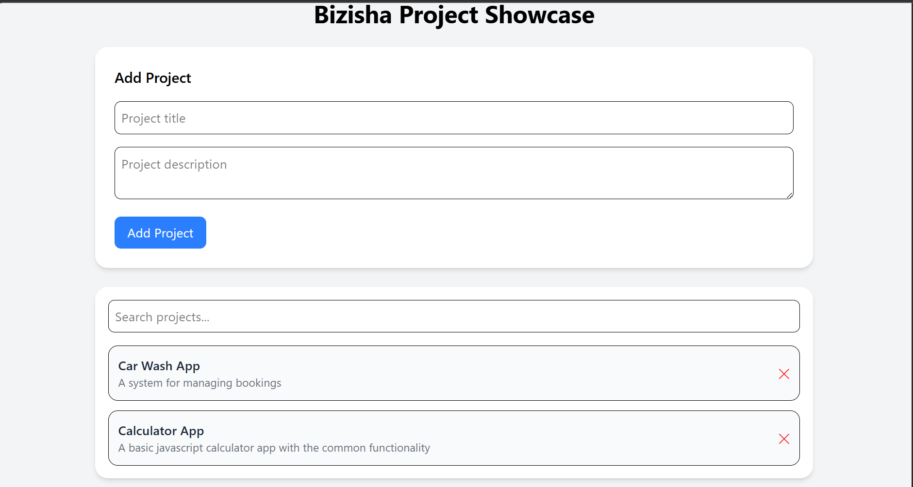

Bizisha – Bizisha Agency Project Showcase App

Bizisha is a modern, responsive full-stack React application that allows users to showcase projects, search through them, and dynamically add new ones. It includes backend integration for persistent data storage.

## 🚀 Features
### 📂 Project Listing
View all projects in a clean card layout
### ➕ Add New Projects
Submit project title and description via a form
Data is saved permanently via backend API
### 🔍 Search Projects
Real-time filtering based on project title
### 🗑️ Delete Projects
Remove projects dynamically
### 💾 Persistent Storage
Projects are stored in a backend database (JSON server / Express)
### 📱 Mobile-Responsive Design
Works seamlessly across mobile, tablet, and desktop
### 🎨 Modern UI
Built with Tailwind CSS
Clean, minimal, and user-friendly interface

## 🧱 Tech Stack
### Frontend
- React (Vite)
- Tailwind CSS
- Fetch API
### Backend
- Node.js
- JSON Server
- db.json (mock database)

## 📂 Project Structure
Bizisha/
│
├── frontend/
│   ├── src/
│   │   ├── components/
│   │   │   ├── ProjectList.jsx
│   │   │   ├── ProjectCard.jsx
│   │   │   └── ProjectForm.jsx
│   │   ├── App.jsx
│   │   └── index.css
│   └── package.json
│
├── backend/
│   ├── db.json
│   └── server.js (or json-server setup)
│
├── .gitignore
└── README.md

## ⚙️ Installation & Setup
1. Fork the Repository
2. Clone the Repository
```bash
git clone https://github.com/your-username/Bizisha-Agency
cd bizisha
```
3. Setup Backend

Navigate to backend folder:
```bash
cd Backend
npm install
```

Start backend server:
```bash
npm start
```

Backend runs on:

http://localhost:3001

4. Setup Frontend

Open a new terminal and run:
```bash
cd Frontend
npm install
npm run dev
```
Frontend runs on:

http://localhost:5173

## 🎯 How to Use the App
### 📝 Add a Project
- Enter title and description
- Click Add
- Project appears instantly and is saved
### Search Projects
- Type in the search bar
- Projects filter in real-time
### Delete a Project
- Click the ❌ button on any project card
### Responsive Experience
- Try resizing the browser or open on mobile

## 📸 Screenshots



## 🔮 Future Improvements
- 🔐 User authentication (Login/Register)
- 🌐 Deploy backend (Render / Railway)
- ☁️ Deploy frontend (Vercel / Netlify)
- 🖼️ Add project images
- ⭐ Favorite or like projects
- 📊 Project categories & tags

## 🧠 Learning Outcomes

This project demonstrates:

- React component architecture
- useState and state lifting
- Event handling in React
- API integration using Fetch
- Full-stack development basics
- Responsive UI design with Tailwind CSS

## 👨‍💻 Author

Deogracious Moriasi